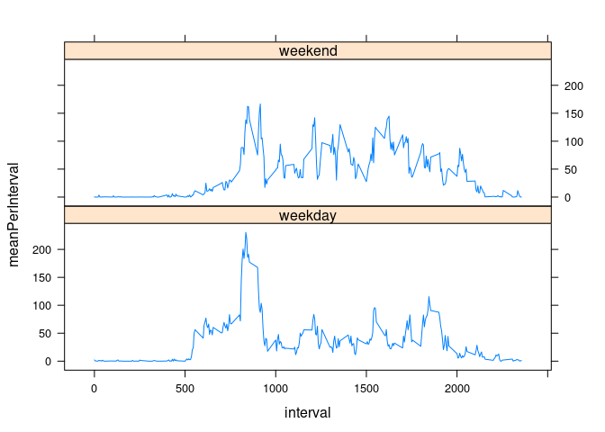

## Loading and preprocessing the data

```r
suppressMessages(library(dplyr))
suppressMessages(library(lattice))
unzip("activity.zip")
activityDataset = read.csv("activity.csv", header = TRUE)
activityDataset$date <- as.Date(activityDataset$date)
```

## What is mean total number of steps taken per day?

```r
totalStepsPerDay <- activityDataset %>%
        group_by(date) %>% 
        summarise(totalPerDay = sum(steps, na.rm = TRUE)) %>%
        .$totalPerDay

hist(totalStepsPerDay)
```

<!-- -->

```r
mean(totalStepsPerDay)
```

```
## [1] 9354.23
```

```r
median(totalStepsPerDay)
```

```
## [1] 10395
```


## What is the average daily activity pattern?

```r
averageStepsPerInterval <- activityDataset %>%
    group_by(interval) %>%
    summarise(averageStepsPerInterval = mean(steps, na.rm = TRUE)) %>%
    .$averageStepsPerInterval

averageStepsPerInterval <- as.data.frame(
    cbind(activityDataset$interval[1:288], averageStepsPerInterval))

names(averageStepsPerInterval) <- c("interval", "average_number_of_steps")

plot(averageStepsPerInterval, type="l")
```

<!-- -->

```r
# Maximum average steps per interval
averageStepsPerInterval %>% 
    filter(average_number_of_steps == max(average_number_of_steps))%>%
    .$interval
```

```
## [1] 835
```


## Imputing missing values

```r
#Number of rows with Nas (only column "steps" has NAs)
sum(is.na(activityDataset$steps))
```

```
## [1] 2304
```

```r
#Replace Nas by the average Step total at that interval
tidyActivityDataset <- activityDataset %>% mutate(steps = ifelse(is.na(steps), 
            averageStepsPerInterval %>% filter(interval == interval) %>% .$average_number_of_steps
            ,steps))

totalStepsPerDay <- tidyActivityDataset %>%
        group_by(date) %>% 
        summarise(totalPerDay = sum(steps, na.rm = TRUE)) %>%
        .$totalPerDay

hist(totalStepsPerDay)
```

<!-- -->

```r
mean(totalStepsPerDay)
```

```
## [1] 10766.19
```

```r
median(totalStepsPerDay)
```

```
## [1] 10766.19
```
The mean and also median rose a bit after imputing the Nas. Furthermore the histogram got narrower, because the Nas were replaced with median value of the interval.

## Are there differences in activity patterns between weekdays and weekends?


```r
#Abbreviated Weekdays in German
abbreviatedWeekdays <- c("Mo","Di","Mi","Do","Fr")

#Add factor column
tidyActivityDataset <- mutate(tidyActivityDataset, weekindicator = factor(ifelse(
    weekdays(date, abbreviate = TRUE) %in% abbreviatedWeekdays,
    "weekday",
    "weekend"
)))

#Create panel plot
tidyActivityDataset <- tidyActivityDataset %>%
    group_by(interval, weekindicator) %>%
    summarise(meanPerInterval = mean(steps, na.rm = TRUE)) %>%
    ungroup()

xyplot(meanPerInterval ~ interval | weekindicator , tidyActivityDataset, type="l", layout=c(1,2))
```

<!-- -->

